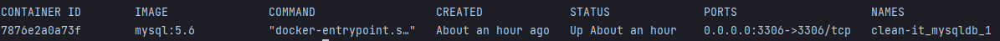

# Clean it

Para este proyecto es necesario tener Docker, docker-compose, NodeJS y Postman instalados. 
El ejercicio se desarrolló utilizando únicamente Nodejs y Docker como lo indicado en
el documento, pero se usó Mysql para la base de datos. Los pasos para iniciarlo son:

1. Correr ``docker-compose up -d`` en la raíz del proyecto, esto levantará un
contenedor de mysql.
   1. Correr el comando ``docker-compose ps`` para verificar que el contenedor de mysql este corriendo, debería mostrar algo
   parecido a:
   
2. Desde la consola en la raíz del proyecto ejecutar ``cd app``
    1. Correr el comando ``npm install`` y esperar a que termine el proceso de node.
    2. Ejecutar ``npm run db``, este comando creará las tablas necesarias para el proyecto.
3. Ejecutar ``npm start`` e importar la colección de Postman ubicada en ``extra-dots``, se puede encontrar documentación en cada request.

Las tablas creadas para este proyecto son:
1. `products`:
   1. id: id único para los productos
   2. name: Nombre del producto
   3. stock: Cantidad disponible del producto
   4. timestamps: timestamps del producto, utilizado para verificar regla de no más de 30 unidades compradas por mes
2. `product_sale_log`:
   1. id: id único para el log de ventas.
   2. product_id: id del producto vendido.
   4. qty: Cantidad vendida del producto.
   5. timestamps: timestamps de la venta, podría ser utilizado para reportes en un futuro.
3. `product_restock_log`:
   1. id: id único para el log de compras.
   2. product_id: id del producto comprado.
   4. qty: Cantidad comprada del producto.
   5. timestamps: timestamps de la compra, podría ser utilizado para reportes en un futuro.